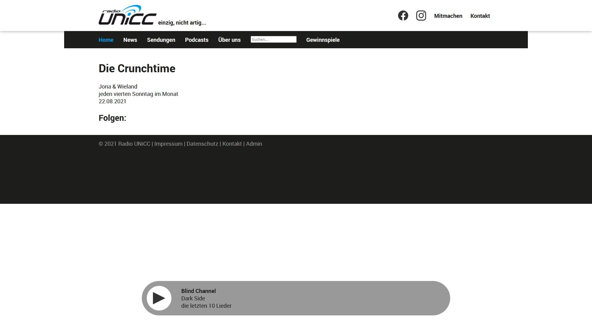

# radio-unicc-website-layout

## Übersicht

So sieht aktuell die Website aus:




## Eigene Version aufsetzen

### Variante 1: ohne Webserver

Für Firefox: Man muss in den Einstellungen `security.fileuri.strict_origin_policy` temporär auf `false` setzen.

Für andere Browser gilt das gleiche, jedoch heißt die Option dort anders oder könnte gar nicht existieren.

Einfach Repo herunterladen und `index.html` im Browser öffnen.

### Variante 2: mit Webserver

```bash
pip install CherryPy
git clone ...
cd ...
start_server
```
`localhost` im Browser öffnen

## Linksammlung
- TYPO 3 Erweiterungen
	- [News](https://docs.typo3.org/p/georgringer/news/8.5/en-us/AdministratorManual/Index.html)
	- [Vue.js](https://docs.typo3.org/p/zotornit/vuejs/1.0/en-us/HowTo/Index.html)

## CSS z-index
| z-index | Element         |
| :-----: | :-------------- |
| 0       | -               |
| 1       | -               |
| 2       | #topics span    |
| 3       | div#heading     |
| 4       | -               |
| 5       | aside@landscape |
| 6       | div#player      |
| 7       | nav ul          |